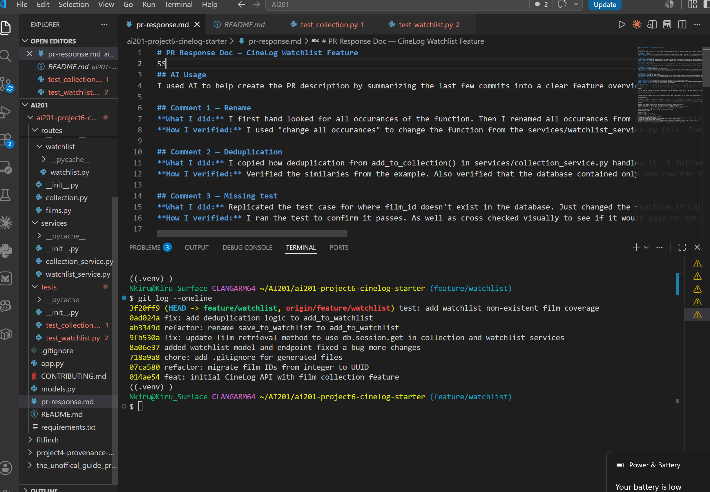

# PR Response Doc — CineLog Watchlist Feature
SS
## AI Usage
I used AI to help create the PR description by summarizing the last few commits into a clear feature overview, design decisions, and manual testing steps. I also used it to tighten the wording so the description was easier to read and matched the project requirements.

## Comment 1 — Rename
**What I did:** I first hand looked for all occurances of the function. Then I renamed all occurances from save_to_watchlist to add_to_watchlist
**How I verified:** I used "change all occurances" to change the function from the services/watchlist_service.py file. Then I prompted AI to search for other occurances within the folder and it found two in routes/watchlist.py

## Comment 2 — Deduplication
**What I did:** I copied how deduplication from add_to_collection() in services/collection_service.py handles it. I follow the same pattern and created an error to run if it fails. 
**How I verified:** Verified the similaries from the example. Also verified that the database contained only one row for that user and film. 

## Comment 3 — Missing test
**What I did:** Replicated the test case for where film_id doesn't exist in the database. Just changed the function it calls for add_to_watchlist() following the same fixture and assertion structure.
**How I verified:** I ran the test to confirm it passes. As well as cross checked visually to see if it would pass or not. 

## Comment 4 — Default visibility
**My position:** Change visibily to false/private
**Reasoning:** For the protection of the user if they do not realize that their watchlist is viewable by other users. I would rather the user be intentional in making the decision of "I want people to see my watchlist" rather than them getting spooked about have a public watchlist. It saves people in those cases. 
**Tradeoff acknowledged:** Having it private by default provides a safer and more privacy. The tradeoff would be lower discoverability and weaker social behavior. 

## Comment 5 — Sort order
**My position:** Filter by date added 
**Reasoning:** Thinking as user who would want to go to the oldest movie in their watchlist that they added because they finally want to mark it off. Having it in order of date added would be benefical. Same case for if a user wants to see their most recent watchlist entry. 
**Engagement with reviewer's point:** I acknowledge that this would make it harder to easily find something that a user may only know by title but if they forget and try adding it again. They would be notified anyways if they already have it on their watchlist. That was a recent bug fixed.z

## Comment 6 — Rebase
**What conflicted:** My conflict was there was two .gitignore files. One on each branch
**How I resolved it:** I reviewed the conflict and accepted the incoming changes from the main branch becaause it was more recent and had more to it. 
**How I verified no conflict remains:** The branch was mergeable. 

## PR Description
<!-- Written at the end — feature overview, design decisions, manual testing steps -->

Summary

This PR adds and hardens the watchlist feature for CineLog. Users can save films to a personal watchlist, avoid duplicate entries, and see their watchlist in a predictable order. The service layer was also updated to align with the current ID handling in the app and to add coverage for invalid film IDs.

What the watchlist feature does

The watchlist lets a user save films they want to watch later. Each saved film is stored as a watchlist entry tied to that user and film, and the feature returns the user’s saved films with watchlist metadata attached.

Design decisions

Visibility default: watchlist entries default to public = true, so saved films are visible unless explicitly changed later.
Sort order: watchlist results are returned in alphabetical order by film title, so the list is stable and easy to scan.
Changes

Updated film lookup in collection and watchlist services to use db.session.get.
Renamed the watchlist helper from save_to_watchlist to add_to_watchlist.
Added deduplication logic so the same film cannot be added to a user’s watchlist twice.
Added regression coverage for trying to add a non-existent film to the watchlist.
Added/updated supporting tests for the new watchlist behavior.
Manual testing steps

Start the app.
Create or log in as a user.
Add a valid film to the watchlist.
Confirm the film appears in the watchlist.
Try adding the same film again.
Confirm the app rejects the duplicate instead of creating a second entry.
Try adding a film ID that does not exist.
Confirm the app raises the expected FilmNotFoundError behavior instead of failing with a database error.
Check the watchlist order and confirm films are returned alphabetically by title.

